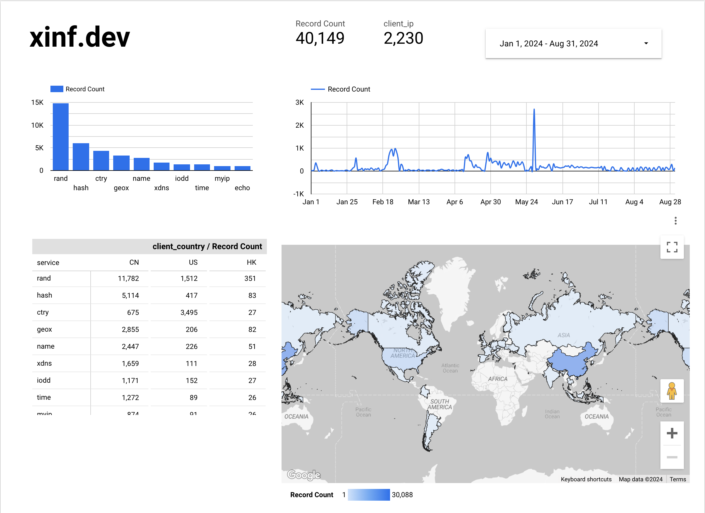

Link to PDF: [https://github.com/racecraftr/racecraftr.github.io/blob/main/resume.pdf](https://github.com/racecraftr/racecraftr.github.io/blob/main/resume.pdf)

# Important Links

GitHub: [https://github.com/racecraftr](https://github.com/racecraftr)

LinkedIn: [https://www.linkedin.com/in/avi-gupta-ag/](https://www.linkedin.com/in/avi-gupta-ag/)

Blogs: [https://medium.com/@savim2020](https://medium.com/@savim2020) and [https://medium.com/hackerlog](https://medium.com/hackerlog)

YouTube: [https://www.youtube.com/channel/UCbfng4kyQt2QEzXktgCECDw](https://www.youtube.com/channel/UCbfng4kyQt2QEzXktgCECDw)

Personal Website: [https://xinf.dev/](https://xinf.dev/)

# **Work Experience**

## Smart Beej	(May 2023 \- August 2023)

-  Helped to set up microcomputers to manage modular, hydroponics-based farms in India in order to combat the effect of climate change and produce food more sustainably. Tasks involved:
- Discussing and designing remote sensor management frameworks with the core engineering team
- Migrating the on-farm software from a proprietary OS to Amazon Web Services’ Greengrass to manage programs remotely
- Calibrating on-site sensors at farms in India, and developing algorithms to process raw sensor input into actual readings for temperature, humidity, etc.
- Data collection on-device and extraction to cloud-based data warehouse
- Work continued over summer and into the fall of 2023 to get the devices production ready

## Gradzilla (May 2024 \- Present)

- Created a web application that used generative AI and real-world college data to aid others in the college selection process.
- [https://gradzilla.app](https://gradzilla.app)
- Video demo: [https://youtu.be/BgpLiC7i-I8](https://youtu.be/BgpLiC7i-I8)
  - More natural search using generative AI (Google Gemini) and Retrieval-Augmented Generation
  - Contains course catalogs
  - Can keep context within a chat session
- Wrote backend in Spring Boot & Flask
  - Deployed on Cloud Run
  - Using Cloud Datastore for storage of colleges and courses
  - Using Cloud Firestore for storage of users, chats, bookmarks, and data vectors
- Wrote in Flutter/Dart
  - Using Cloud Storage to store web files
  - Using Google Authentication to manage log-ins

## XINF	(November 2022 \- Present)

- Created a suite of micro utilities that perform common, boilerplate tasks for developers through a simple REST API.
- [https://xinf.dev/](https://xinf.dev/)
- A REST api to help app writers conveniently get common pieces of information.
- Written in Go, deployed on Cloud run, using BigQuery for analytics.
- Some of these functions are being used by other developers around the world.

# **Education**

- College Freshman at the University of Maryland \- College park
  - Majoring in Computer Science with a focus in Machine Learning
  - Part of UMD’s Tactus Choir

- High School Graduate (Rutgers Preparatory School, Somerset, NJ, USA)
- GPA: 4.22 (weighted)
  - Relevant courses: AP Computer Science, Advanced Software Design, AP Calculus AB, AP Physics, AP Environmental Science

- ACSL (American Computer Science League)
  - Finalist for 4 years in a row
  - 2019: Team won first place in New Jersey in the Junior Division, 7th in world competition

- MEGA Hackathon 2022
  - Won best high school project
  - Official website: [https://megahack.tech/](https://megahack.tech/)

# Skills

**Java/Spring Boot (7 years)**, **Go (4 years)**, **Dart/Flutter (4 years)**, Python (4 years), Google Cloud Platform (GCP) (3 years), Kotlin (2 years), Javascript (1 year), LaTeX (1 year), VSCode (3 years), IntelliJ (7 years), GitHub (5 years), Xcode (2 years), Swift/SwiftUI (2 years), Google Docs (7 years), Processing(.pde) (5 years), Neural Networks (1 year), Generative AI (Gemini, ChatGPT) (1 year)

- LaTeX example: [https://github.com/racecraftr/racecraftr.github.io/blob/main/latex_example/latex_example.pdf](https://github.com/racecraftr/racecraftr.github.io/blob/main/latex_example/latex_example.pdf)

# Relevant Projects

## Gradzilla	(May 2024 \- Present)

- [https://gradzilla.app](https://gradzilla.app)
- Created a web application that used generative AI and real-world college data to aid others in the college selection process.
- Video demo: [https://youtu.be/BgpLiC7i-I8](https://youtu.be/BgpLiC7i-I8)
  - More natural search using generative AI (Google Gemini) and Retrieval-Augmented Generation
  - Contains course catalogs
  - Can keep context within a chat session
- Backend written in Spring Boot & Flask
  - Deployed on Cloud Run
  - Using Cloud Datastore for storage of colleges and courses
  - Using Cloud Firestore for storage of users, chats, bookmarks, and data vectors
- Frontend written in Flutter/Dart
  - Using Cloud Storage to store web files
  - Using Google Authentication to manage log-ins

## XINF	(November 2022 \- Present)

- [https://xinf.dev/](https://xinf.dev/): a suite of micro utilities that perform common, boilerplate tasks for developers.
- A REST api to help app writers conveniently get common pieces of information.
- Written in Go, deployed on Cloud run, using BigQuery for analytics.
- Some of these functions are being used by other developers around the world.

## Neural Networks	(January 2024)

- [https://github.com/racecraftr/neural\_net\_book](https://github.com/racecraftr/neural_net_book): python project based off of the Neural Networks From Scratch book: [https://nnfs.io/](https://nnfs.io/)
- No neural network libraries used (PyTorch, TensorFlow), only NumPy and matplotlib
- Created various LLM models

## Teacher, (Youth Coding Foundation	May 2022 \- June 2023)

- Collaborated with two other classmates to create a Python programming course. The course contained slides and sample code to teach middle schoolers a 10-day course for Python.
- Link to slides: [https://drive.google.com/drive/folders/1pwI8gpP6Cn3MLrQ\_ND-bh\_e4uEnYPyV0?usp=sharing](https://drive.google.com/drive/folders/1pwI8gpP6Cn3MLrQ_ND-bh_e4uEnYPyV0?usp=sharing)

## Image edge detection

- Wrote a program that detects edges in images using the Processing Language. This was done by applying a basic matrix transformation on the underlying image.
- Link to blog post: [https://medium.com/hackerlog/edge-detection-4d42ca234dfb](https://medium.com/hackerlog/edge-detection-4d42ca234dfb)

## “Useless” Java (June 2022 \- August 2022)

- Consistently uploaded interesting pieces of code written in Java & Kotlin over the course of the Summer of 2022\. Supplemented code with blog posts and Youtube videos explaining and demonstrating the overall structure and functionality of each day.
- Link to GitHub [https://github.com/racecraftr/UselessJava](https://github.com/racecraftr/UselessJava)
- Blog series on [https://medium.com/@savim2020](https://medium.com/@savim2020)
- Focused on:
  - Messing with Libraries
  - String manipulation
  - Esoteric Programming Language Program Generation
  - Making the code as useless as possible

## Untitled App (In progress)	(July 2022 \- Present)

- Location-based social media app that has the following functionality
  - Asynchronous access to location data
  - Posting and retrieval of social media posts
  - Liking and like counting
  - Reporting with removal of content after certain number of reports
- Backend written in Spring Boot
  - Deployed on Cloud Run
  - Using Cloud Datastore for storage of messages
  - Using BigQuery for analytics
  - Using Cloud Storage for image and large object storage
- Frontend written in Flutter/Dart

## Stay Safe (In progress)	(August 2023 \- Present)

- App that allows administrators of commercial/educational facilities to quickly send alerts to others
  - Alerts can refer to any sort of emergency, such as medical, criminal, etc.
- Backend written in Spring boot
- Frontend written in Flutter/Dart

## Interactive Series

- Interactive, visual programs
- Exploring use of Computer Science as Art
- Written in the Processing Language
- Series on [https://medium.com/hackerlog](https://medium.com/hackerlog)

# **For fun**

## In general

- Juggling
- Proficiency in written and spoken french
- Learning Japanese and Hindi

## High school

- Cross Country running
- Member of school choirs
- Cast member in school-run musicals for three years in a row
- Participant in School Cultural Shows
- Coding in my fun time
- Ran the Chess Club at school

## College

- Member of school choirs

# **Other information**

- United states citizen